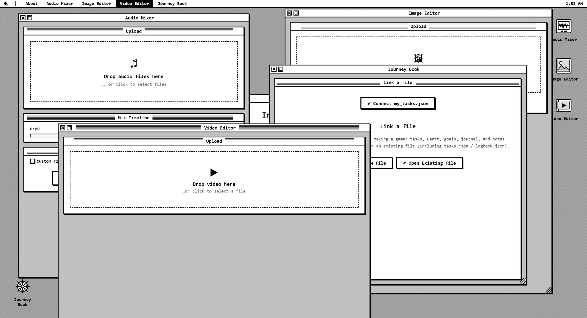

# Indie Toolbox

**[Open Indie Toolbox](https://pavele11.github.io/IndieToolbox/)**

A collection of lightweight, browser-based tools for indie developers and creators. No installations, no accounts, no online services — just open and use. Everything runs locally in your browser, your files never leave your machine.

Styled after classic Macintosh System software, with a desktop environment, draggable windows, and a retro pixel aesthetic.

## Tools

**Image Editor** — Convert images between PNG, JPEG, WebP, and BMP (including HEIC/HEIF decoding). Resize, crop, and adjust quality. Drag & drop or use native file dialogs with the save path defaulting to the original file's directory.

**Audio Mixer** — Load multiple audio tracks, trim, apply fades, adjust volume, and arrange them on a shared timeline by dragging. Set custom timeline length to add pauses and gaps. Preview the mix and export to WAV.

**Journey Book** — A single local `.json` file that travels with you while you build a game: tasks (with Pomodoro), Gantt, goals, a journal (dated entries), and note cards (no dates) with optional archive and restore. Reconnects automatically on your next visit.

**Video Editor** — Preview video files, view file info (size, resolution, duration), resize with locked or free aspect ratio, trim from start or end, toggle audio on/off, and export to WebM.

## License

See [LICENSE](LICENSE) for details. Free for personal and non-commercial use.
